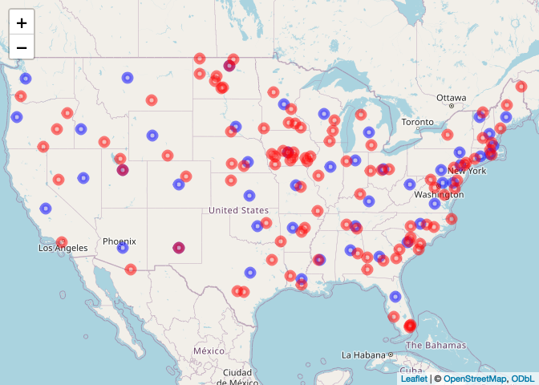
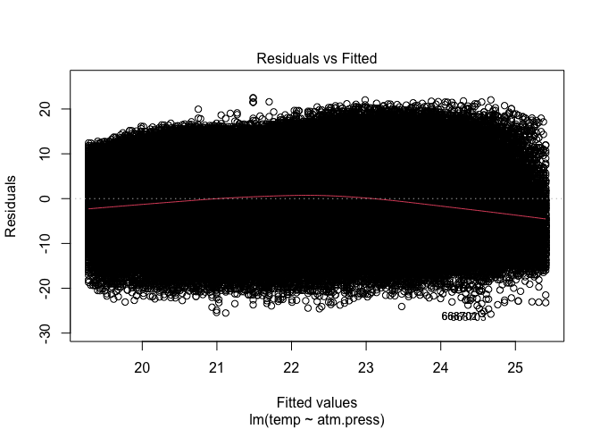
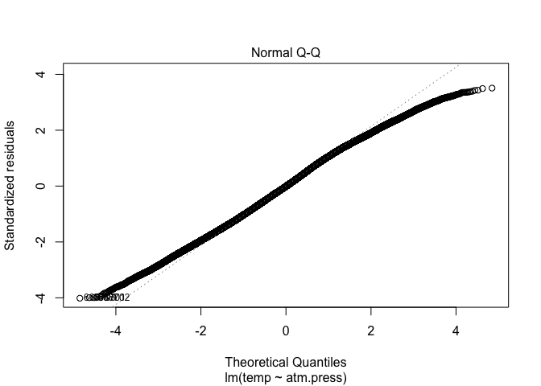
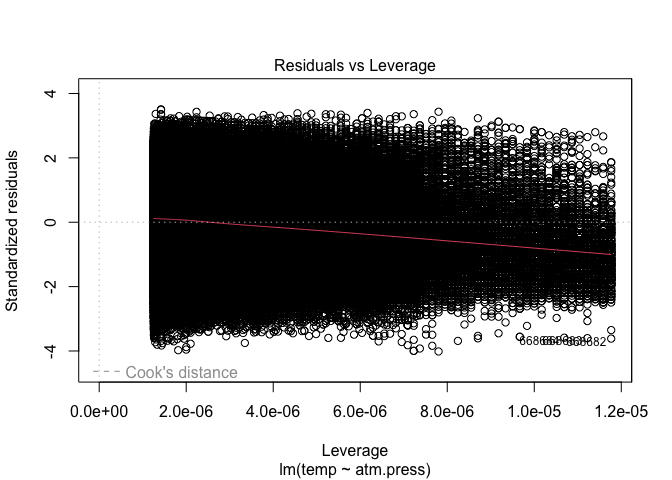

Lab 05 - Data Wrangling
================
Jing Yu
02-07-2024

# Learning goals

- Use the `merge()` function to join two datasets.
- Deal with missings and impute data.
- Identify relevant observations using `quantile()`.
- Practice your GitHub skills.

# Lab description

For this lab we will be dealing with the meteorological dataset `met`.
In this case, we will use `data.table` to answer some questions
regarding the `met` dataset, while at the same time practice your
Git+GitHub skills for this project.

This markdown document should be rendered using `github_document`
document.

# Part 1: Setup a Git project and the GitHub repository

1.  Go to wherever you are planning to store the data on your computer,
    and create a folder for this project

2.  In that folder, save [this
    template](https://github.com/JSC370/JSC370-2024/blob/main/labs/lab05/lab05-wrangling-gam.Rmd)
    as “README.Rmd”. This will be the markdown file where all the magic
    will happen.

3.  Go to your GitHub account and create a new repository of the same
    name that your local folder has, e.g., “JSC370-labs”.

4.  Initialize the Git project, add the “README.Rmd” file, and make your
    first commit.

5.  Add the repo you just created on GitHub.com to the list of remotes,
    and push your commit to origin while setting the upstream.

Most of the steps can be done using command line:

``` sh
# Step 1
cd ~/Documents
mkdir JSC370-labs
cd JSC370-labs

# Step 2
wget https://raw.githubusercontent.com/JSC370/JSC370-2024/main/labs/lab05/lab05-wrangling-gam.Rmd
mv lab05-wrangling-gam.Rmd README.Rmd
# if wget is not available,
curl https://raw.githubusercontent.com/JSC370/JSC370-2024/main/labs/lab05/lab05-wrangling-gam.Rmd --output README.Rmd

# Step 3
# Happens on github

# Step 4
git init
git add README.Rmd
git commit -m "First commit"

# Step 5
git remote add origin git@github.com:[username]/JSC370-labs
git push -u origin master
```

You can also complete the steps in R (replace with your paths/username
when needed)

``` r
# Step 1
setwd("~/Documents")
dir.create("JSC370-labs")
setwd("JSC370-labs")

# Step 2
download.file(
  "https://raw.githubusercontent.com/JSC370/JSC370-2024/main/labs/lab05/lab05-wrangling-gam.Rmd",
  destfile = "README.Rmd"
  )

# Step 3: Happens on Github

# Step 4
system("git init && git add README.Rmd")
system('git commit -m "First commit"')

# Step 5
system("git remote add origin git@github.com:[username]/JSC370-labs")
system("git push -u origin master")
```

Once you are done setting up the project, you can now start working with
the MET data.

## Setup in R

1.  Load the `data.table` (and the `dtplyr` and `dplyr` packages),
    `mgcv`, `ggplot2`, `leaflet`, `kableExtra`.

``` r
library(webshot)
library(data.table)
library(dtplyr)
library(dplyr)
```

    ## 
    ## Attaching package: 'dplyr'

    ## The following objects are masked from 'package:data.table':
    ## 
    ##     between, first, last

    ## The following objects are masked from 'package:stats':
    ## 
    ##     filter, lag

    ## The following objects are masked from 'package:base':
    ## 
    ##     intersect, setdiff, setequal, union

``` r
library(mgcv)
```

    ## Loading required package: nlme

    ## 
    ## Attaching package: 'nlme'

    ## The following object is masked from 'package:dplyr':
    ## 
    ##     collapse

    ## This is mgcv 1.8-41. For overview type 'help("mgcv-package")'.

``` r
library(ggplot2)
library(leaflet)
```

    ## Warning: package 'leaflet' was built under R version 4.2.3

``` r
library(kableExtra)
```

    ## Warning: package 'kableExtra' was built under R version 4.2.3

    ## 
    ## Attaching package: 'kableExtra'

    ## The following object is masked from 'package:dplyr':
    ## 
    ##     group_rows

``` r
fn <- "https://raw.githubusercontent.com/JSC370/JSC370-2024/main/data/met_all_2023.gz"
if (!file.exists("met_all_2023.gz"))
  download.file(fn, destfile = "met_all_2023.gz")
met <- data.table::fread("met_all_2023.gz")
```

2.  Load the met data from
    <https://github.com/JSC370/JSC370-2024/main/data/met_all_2023.gz> or
    (Use
    <https://raw.githubusercontent.com/JSC370/JSC370-2024/main/data/met_all_2023.gz>
    to download programmatically), and also the station data. For the
    latter, you can use the code we used during lecture to pre-process
    the stations data:

``` r
# Download the data
stations <- fread("ftp://ftp.ncdc.noaa.gov/pub/data/noaa/isd-history.csv")
stations[, USAF := as.integer(USAF)]
```

    ## Warning in eval(jsub, SDenv, parent.frame()): NAs introduced by coercion

``` r
# Dealing with NAs and 999999
stations[, USAF   := fifelse(USAF == 999999, NA_integer_, USAF)]
stations[, CTRY   := fifelse(CTRY == "", NA_character_, CTRY)]
stations[, STATE  := fifelse(STATE == "", NA_character_, STATE)]

# Selecting the three relevant columns, and keeping unique records
stations <- unique(stations[, list(USAF, CTRY, STATE, LAT, LON)])

# Dropping NAs
stations <- stations[!is.na(USAF)]

# Removing duplicates
stations[, n := 1:.N, by = .(USAF)]
stations <- stations[n == 1,][, n := NULL]

# Read in the met data and fix lat, lon, temp
met$lat <- met$lat/1000
met$lon <- met$lon/1000
met$temp <- met$temp/10
met$wind.sp <- met$wind.sp/10
met$atm.press <- met$atm.press/10
```

3.  Merge the data as we did during the lecture. Use the `merge()` code
    and you can also try the tidy way with `left_join()`

``` r
met <- merge(x = met, y = stations, 
             by.x  = "USAFID", by.y  = "USAF", 
             all.x = TRUE, all.y = FALSE)
```

## Question 1: Identifying Representative Stations

Across all weather stations, which stations have the median values of
temperature, wind speed, and atmospheric pressure? Using the
`quantile()` function, identify these three stations. Do they coincide?

``` r
# Calculate median values for temperature, wind speed, and atmospheric pressure
medians <- met[, .(temp_median = quantile(temp, 0.5, na.rm = TRUE),
                   wind.sp_median = quantile(wind.sp, 0.5, na.rm = TRUE),
                   atm.press_median = quantile(atm.press, 0.5, na.rm = TRUE)
                   )]

# Median by station
station_med <- met[, .(temp = quantile(temp, 0.5, na.rm = TRUE),
                       wind.sp = quantile(wind.sp, 0.5, na.rm = TRUE),
                       atm.press = quantile(atm.press, 0.5, na.rm = TRUE)
                       ),
                   by = .(USAFID, STATE)]

# Identify stations with median values
station_med[, temp_dist:= abs(temp - medians$temp_median)]
station_med_temp <- station_med[temp_dist == 0]

station_med[, wind.sp_dist:= abs(wind.sp - medians$wind.sp_median)]
station_med_wind.sp <- station_med[wind.sp_dist == 0]

station_med[, atm.press_dist:= abs(atm.press - medians$atm.press_median)]
station_med_atm.press <- station_med[atm.press_dist == 0]
```

Next identify the stations have these median values.

``` r
coincide <- station_med[temp_dist==0 & wind.sp_dist == 0 & atm.press_dist == 0]
coincide
```

    ##    USAFID STATE temp wind.sp atm.press temp_dist wind.sp_dist atm.press_dist
    ## 1: 723119    SC 21.7     3.1    1011.7         0            0              0

Knit the document, commit your changes, and save it on GitHub. Don’t
forget to add `README.md` to the tree, the first time you render it.

## Question 2: Identifying Representative Stations per State

Now let’s find the weather stations by state with closest temperature
and wind speed based on the euclidean distance from these medians.

``` r
# Calculate median values for temperature and wind speed for each state
state_medians <- met[, .(temp_median = quantile(temp, 0.5, na.rm = TRUE),
                         wind.sp_median = quantile(wind.sp, 0.5, na.rm = TRUE)),
                     by = .(STATE)]

# Join state medians with station_med
station_med <- merge(station_med, state_medians, by = "STATE", all.x = TRUE)

# Calculate Euclidean distance
station_med[, euclidean_dist := sqrt((temp_median - temp)^2 + (wind.sp_median - wind.sp)^2)]

# Representative Stations per State (containing ties)
station_med <- station_med[, .(USAFID = USAFID[which(euclidean_dist == min(euclidean_dist, na.rm = TRUE))]),
            by = .(STATE)]
station_med
```

    ##      STATE USAFID
    ##   1:    AL 720265
    ##   2:    AR 722188
    ##   3:    AR 723405
    ##   4:    AR 743312
    ##   5:    AZ 722728
    ##  ---             
    ## 100:    WI 726415
    ## 101:    WI 726457
    ## 102:    WI 726509
    ## 103:    WV 724177
    ## 104:    WY 720521

Knit the doc and save it on GitHub.

## Question 3: In the Geographic Center?

For each state, identify which station is closest to the geographic
mid-point (median) of the state. Combining these with the stations you
identified in the previous question, use `leaflet()` to visualize all
~100 points in the same figure, applying different colors for the
geographic median and the temperature and wind speed median.

``` r
# Calculate median latitude and longitude for each state
state_midpoints <- met[, .(median_lat = quantile(lat, 0.5, na.rm = TRUE),
                           median_lon = quantile(lon, 0.5, na.rm = TRUE)),
                      by = .(STATE)]

# Calculate median values for lon and lat for each station
station_midpoints <- met[, .(lon = quantile(lon, 0.5, na.rm = TRUE),
                             lat = quantile(lat, 0.5, na.rm = TRUE)), 
                         by = .(USAFID, STATE)]

# Join state midpoints with met
station_geo <- merge(station_midpoints, state_midpoints, by = "STATE", all.x = TRUE)

# Calculate distance between each station and its state's midpoint
station_geo[, midpoint_dist := sqrt((lat - median_lat)^2 + (lon - median_lon)^2)]

# Find closest station to each state's midpoint
station_geo <- station_geo[, .(USAFID = USAFID[which(midpoint_dist == min(midpoint_dist, na.rm = TRUE))]),by =.(STATE)]
station_geo
```

    ##     STATE USAFID
    ##  1:    AL 722300
    ##  2:    AR 723429
    ##  3:    AZ 722783
    ##  4:    CA 745046
    ##  5:    CO 726396
    ##  6:    CT 720545
    ##  7:    DE 724088
    ##  8:    FL 722213
    ##  9:    GA 722175
    ## 10:    IA 725466
    ## 11:    ID 726810
    ## 12:    IL 724397
    ## 13:    IN 720736
    ## 14:    KS 724506
    ## 15:    KY 720448
    ## 16:    LA 720468
    ## 17:    MA 744907
    ## 18:    MD 724060
    ## 19:    ME 726073
    ## 20:    MI 725405
    ## 21:    MN 726550
    ## 22:    MO 720869
    ## 23:    MS 722350
    ## 24:    MT 727755
    ## 25:    NC 722201
    ## 26:    ND 720867
    ## 27:    NE 725513
    ## 28:    NH 726050
    ## 29:    NJ 722247
    ## 30:    NM 722683
    ## 31:    NV 724770
    ## 32:    NY 725145
    ## 33:    OH 720928
    ## 34:    OK 722187
    ## 35:    OR 726945
    ## 36:    PA 725118
    ## 37:    RI 725074
    ## 38:    SC 747900
    ## 39:    SD 726530
    ## 40:    TN 721031
    ## 41:    TX 722570
    ## 42:    UT 725724
    ## 43:    VA 720498
    ## 44:    VT 726114
    ## 45:    WA 727930
    ## 46:    WI 726465
    ## 47:    WV 720328
    ## 48:    WY 726720
    ##     STATE USAFID

``` r
# Combining these with the stations identified in the previous question
station_med <- merge(station_med, station_midpoints, 
                     by = c("USAFID", "STATE"), 
                     all.x = TRUE, all.y = FALSE)

station_geo <- merge(station_geo, station_midpoints, 
                     by = c("USAFID", "STATE"), 
                     all.x = TRUE, all.y = FALSE)

map <- leaflet(station_geo) %>%
  addTiles() %>%
  addCircleMarkers(~lon, ~lat, 
                   color = "blue", radius = 5, 
                   popup = ~paste("USAFID:", USAFID, "<br>", "STATE", STATE)) %>%
  addCircleMarkers(data = station_med, ~lon, ~lat, 
                   color = "red", radius = 5, 
                   popup = ~paste("USAFID:", USAFID, "<br>", "STATE", STATE))
map
```

<!-- -->

Knit the doc and save it on GitHub.

## Question 4: Summary Table with `kableExtra`

Generate a summary table using `kable` where the rows are each state and
the columns represent average temperature broken down by low, median,
and high elevation stations.

Use the following breakdown for elevation:

- Low: elev \< 93
- Mid: elev \>= 93 and elev \< 401
- High: elev \>= 401

``` r
library(tidyr)

# Categorize stations by elevation
met[, elev_cat := ifelse(elev < 93, "Low",
                         ifelse(elev < 401, "Mid", "High"))]

# Calculate average temperature for each state and elevation category
summary_df <- met %>%
  group_by(STATE, elev_cat) %>%
  summarise(avg_temp = mean(temp, na.rm = TRUE)) %>%
  pivot_wider(names_from = elev_cat, values_from = avg_temp)
```

    ## `summarise()` has grouped output by 'STATE'. You can override using the
    ## `.groups` argument.

``` r
# Display the table
summary_df %>%
  kable("html") %>%
  kable_styling(bootstrap_options = c("striped", "hover", "condensed", "responsive"))
```

<table class="table table-striped table-hover table-condensed table-responsive" style="margin-left: auto; margin-right: auto;">
<thead>
<tr>
<th style="text-align:left;">
STATE
</th>
<th style="text-align:right;">
High
</th>
<th style="text-align:right;">
Low
</th>
<th style="text-align:right;">
Mid
</th>
</tr>
</thead>
<tbody>
<tr>
<td style="text-align:left;">
AL
</td>
<td style="text-align:right;">
NA
</td>
<td style="text-align:right;">
25.07106
</td>
<td style="text-align:right;">
23.79775
</td>
</tr>
<tr>
<td style="text-align:left;">
AR
</td>
<td style="text-align:right;">
23.723926
</td>
<td style="text-align:right;">
25.58698
</td>
<td style="text-align:right;">
24.40578
</td>
</tr>
<tr>
<td style="text-align:left;">
AZ
</td>
<td style="text-align:right;">
23.892609
</td>
<td style="text-align:right;">
29.28585
</td>
<td style="text-align:right;">
30.38057
</td>
</tr>
<tr>
<td style="text-align:left;">
CA
</td>
<td style="text-align:right;">
18.148808
</td>
<td style="text-align:right;">
18.25508
</td>
<td style="text-align:right;">
18.77071
</td>
</tr>
<tr>
<td style="text-align:left;">
CO
</td>
<td style="text-align:right;">
15.184075
</td>
<td style="text-align:right;">
NA
</td>
<td style="text-align:right;">
NA
</td>
</tr>
<tr>
<td style="text-align:left;">
CT
</td>
<td style="text-align:right;">
NA
</td>
<td style="text-align:right;">
19.37249
</td>
<td style="text-align:right;">
18.78433
</td>
</tr>
<tr>
<td style="text-align:left;">
DE
</td>
<td style="text-align:right;">
NA
</td>
<td style="text-align:right;">
21.40611
</td>
<td style="text-align:right;">
NA
</td>
</tr>
<tr>
<td style="text-align:left;">
FL
</td>
<td style="text-align:right;">
NA
</td>
<td style="text-align:right;">
26.61484
</td>
<td style="text-align:right;">
NA
</td>
</tr>
<tr>
<td style="text-align:left;">
GA
</td>
<td style="text-align:right;">
NA
</td>
<td style="text-align:right;">
24.80529
</td>
<td style="text-align:right;">
23.23841
</td>
</tr>
<tr>
<td style="text-align:left;">
IA
</td>
<td style="text-align:right;">
21.992787
</td>
<td style="text-align:right;">
NA
</td>
<td style="text-align:right;">
22.26228
</td>
</tr>
<tr>
<td style="text-align:left;">
ID
</td>
<td style="text-align:right;">
16.415667
</td>
<td style="text-align:right;">
NA
</td>
<td style="text-align:right;">
NA
</td>
</tr>
<tr>
<td style="text-align:left;">
IL
</td>
<td style="text-align:right;">
20.843173
</td>
<td style="text-align:right;">
NA
</td>
<td style="text-align:right;">
22.11707
</td>
</tr>
<tr>
<td style="text-align:left;">
IN
</td>
<td style="text-align:right;">
NA
</td>
<td style="text-align:right;">
NA
</td>
<td style="text-align:right;">
20.12731
</td>
</tr>
<tr>
<td style="text-align:left;">
KS
</td>
<td style="text-align:right;">
22.098776
</td>
<td style="text-align:right;">
NA
</td>
<td style="text-align:right;">
24.16196
</td>
</tr>
<tr>
<td style="text-align:left;">
KY
</td>
<td style="text-align:right;">
20.178196
</td>
<td style="text-align:right;">
NA
</td>
<td style="text-align:right;">
21.36103
</td>
</tr>
<tr>
<td style="text-align:left;">
LA
</td>
<td style="text-align:right;">
NA
</td>
<td style="text-align:right;">
27.61819
</td>
<td style="text-align:right;">
26.09414
</td>
</tr>
<tr>
<td style="text-align:left;">
MA
</td>
<td style="text-align:right;">
NA
</td>
<td style="text-align:right;">
17.44477
</td>
<td style="text-align:right;">
17.59058
</td>
</tr>
<tr>
<td style="text-align:left;">
MD
</td>
<td style="text-align:right;">
20.648332
</td>
<td style="text-align:right;">
21.25462
</td>
<td style="text-align:right;">
20.62255
</td>
</tr>
<tr>
<td style="text-align:left;">
ME
</td>
<td style="text-align:right;">
15.329681
</td>
<td style="text-align:right;">
15.23159
</td>
<td style="text-align:right;">
15.43930
</td>
</tr>
<tr>
<td style="text-align:left;">
MI
</td>
<td style="text-align:right;">
17.977982
</td>
<td style="text-align:right;">
NA
</td>
<td style="text-align:right;">
18.54432
</td>
</tr>
<tr>
<td style="text-align:left;">
MN
</td>
<td style="text-align:right;">
19.931963
</td>
<td style="text-align:right;">
22.66275
</td>
<td style="text-align:right;">
21.15523
</td>
</tr>
<tr>
<td style="text-align:left;">
MO
</td>
<td style="text-align:right;">
23.300286
</td>
<td style="text-align:right;">
25.79654
</td>
<td style="text-align:right;">
23.77652
</td>
</tr>
<tr>
<td style="text-align:left;">
MS
</td>
<td style="text-align:right;">
NA
</td>
<td style="text-align:right;">
26.34285
</td>
<td style="text-align:right;">
24.66682
</td>
</tr>
<tr>
<td style="text-align:left;">
MT
</td>
<td style="text-align:right;">
16.293015
</td>
<td style="text-align:right;">
NA
</td>
<td style="text-align:right;">
NA
</td>
</tr>
<tr>
<td style="text-align:left;">
NC
</td>
<td style="text-align:right;">
18.046833
</td>
<td style="text-align:right;">
22.82945
</td>
<td style="text-align:right;">
21.21073
</td>
</tr>
<tr>
<td style="text-align:left;">
ND
</td>
<td style="text-align:right;">
20.415848
</td>
<td style="text-align:right;">
NA
</td>
<td style="text-align:right;">
21.79236
</td>
</tr>
<tr>
<td style="text-align:left;">
NE
</td>
<td style="text-align:right;">
21.048920
</td>
<td style="text-align:right;">
NA
</td>
<td style="text-align:right;">
23.48598
</td>
</tr>
<tr>
<td style="text-align:left;">
NH
</td>
<td style="text-align:right;">
7.243417
</td>
<td style="text-align:right;">
17.78844
</td>
<td style="text-align:right;">
16.77731
</td>
</tr>
<tr>
<td style="text-align:left;">
NJ
</td>
<td style="text-align:right;">
NA
</td>
<td style="text-align:right;">
19.96563
</td>
<td style="text-align:right;">
19.31963
</td>
</tr>
<tr>
<td style="text-align:left;">
NM
</td>
<td style="text-align:right;">
22.448418
</td>
<td style="text-align:right;">
NA
</td>
<td style="text-align:right;">
NA
</td>
</tr>
<tr>
<td style="text-align:left;">
NV
</td>
<td style="text-align:right;">
20.849170
</td>
<td style="text-align:right;">
NA
</td>
<td style="text-align:right;">
NA
</td>
</tr>
<tr>
<td style="text-align:left;">
NY
</td>
<td style="text-align:right;">
15.887585
</td>
<td style="text-align:right;">
18.75621
</td>
<td style="text-align:right;">
18.31489
</td>
</tr>
<tr>
<td style="text-align:left;">
OH
</td>
<td style="text-align:right;">
NA
</td>
<td style="text-align:right;">
NA
</td>
<td style="text-align:right;">
19.43774
</td>
</tr>
<tr>
<td style="text-align:left;">
OK
</td>
<td style="text-align:right;">
24.000040
</td>
<td style="text-align:right;">
NA
</td>
<td style="text-align:right;">
25.07676
</td>
</tr>
<tr>
<td style="text-align:left;">
OR
</td>
<td style="text-align:right;">
16.711553
</td>
<td style="text-align:right;">
15.20318
</td>
<td style="text-align:right;">
16.39100
</td>
</tr>
<tr>
<td style="text-align:left;">
PA
</td>
<td style="text-align:right;">
17.286934
</td>
<td style="text-align:right;">
20.34185
</td>
<td style="text-align:right;">
19.40527
</td>
</tr>
<tr>
<td style="text-align:left;">
RI
</td>
<td style="text-align:right;">
NA
</td>
<td style="text-align:right;">
17.88116
</td>
<td style="text-align:right;">
17.46589
</td>
</tr>
<tr>
<td style="text-align:left;">
SC
</td>
<td style="text-align:right;">
NA
</td>
<td style="text-align:right;">
23.68407
</td>
<td style="text-align:right;">
22.38995
</td>
</tr>
<tr>
<td style="text-align:left;">
SD
</td>
<td style="text-align:right;">
20.639922
</td>
<td style="text-align:right;">
NA
</td>
<td style="text-align:right;">
22.79495
</td>
</tr>
<tr>
<td style="text-align:left;">
TN
</td>
<td style="text-align:right;">
19.457179
</td>
<td style="text-align:right;">
25.81362
</td>
<td style="text-align:right;">
22.89642
</td>
</tr>
<tr>
<td style="text-align:left;">
TX
</td>
<td style="text-align:right;">
26.500393
</td>
<td style="text-align:right;">
28.74462
</td>
<td style="text-align:right;">
28.08021
</td>
</tr>
<tr>
<td style="text-align:left;">
UT
</td>
<td style="text-align:right;">
19.754720
</td>
<td style="text-align:right;">
NA
</td>
<td style="text-align:right;">
NA
</td>
</tr>
<tr>
<td style="text-align:left;">
VA
</td>
<td style="text-align:right;">
17.954522
</td>
<td style="text-align:right;">
21.34826
</td>
<td style="text-align:right;">
20.49998
</td>
</tr>
<tr>
<td style="text-align:left;">
VT
</td>
<td style="text-align:right;">
NA
</td>
<td style="text-align:right;">
NaN
</td>
<td style="text-align:right;">
16.89971
</td>
</tr>
<tr>
<td style="text-align:left;">
WA
</td>
<td style="text-align:right;">
16.810354
</td>
<td style="text-align:right;">
15.25193
</td>
<td style="text-align:right;">
17.80542
</td>
</tr>
<tr>
<td style="text-align:left;">
WI
</td>
<td style="text-align:right;">
17.994615
</td>
<td style="text-align:right;">
NA
</td>
<td style="text-align:right;">
19.56563
</td>
</tr>
<tr>
<td style="text-align:left;">
WV
</td>
<td style="text-align:right;">
17.492150
</td>
<td style="text-align:right;">
NA
</td>
<td style="text-align:right;">
19.31079
</td>
</tr>
<tr>
<td style="text-align:left;">
WY
</td>
<td style="text-align:right;">
13.748173
</td>
<td style="text-align:right;">
NA
</td>
<td style="text-align:right;">
NA
</td>
</tr>
</tbody>
</table>

Knit the document, commit your changes, and push them to GitHub.

## Question 5: Advanced Regression

Let’s practice running regression models with smooth functions on X. We
need the `mgcv` package and `gam()` function to do this.

- using your data with the median values per station, first create a
  lazy table. Filter out values of atmospheric pressure outside of the
  range 1000 to 1020. Examine the association between temperature (y)
  and atmospheric pressure (x). Create a scatterplot of the two
  variables using ggplot2. Add both a linear regression line and a
  smooth line.

- fit both a linear model and a spline model (use `gam()` with a cubic
  regression spline on wind speed). Summarize and plot the results from
  the models and interpret which model is the best fit and why.

``` r
# Filter data and create a scatterplot
df <- met %>%
  filter(between(atm.press, 1000, 1020)) %>%
  collect()

ggplot(df, aes(x = atm.press, y = temp)) +
  geom_point() +
  geom_smooth(method = "lm", color = "red") +
  geom_smooth(color = "blue")
```

    ## `geom_smooth()` using formula = 'y ~ x'

    ## Warning: Removed 389 rows containing non-finite values (`stat_smooth()`).

    ## `geom_smooth()` using method = 'gam' and formula = 'y ~ s(x, bs = "cs")'

    ## Warning: Removed 389 rows containing non-finite values (`stat_smooth()`).

    ## Warning: Removed 389 rows containing missing values (`geom_point()`).

<!-- -->

``` r
# Fit a linear model
linear_model <- lm(temp ~ atm.press, data = df)

# Fit a spline model
spline_model <- gam(temp ~ s(wind.sp, bs = "cr"), data = df)

# Summarize the models
summary(linear_model)
```

    ## 
    ## Call:
    ## lm(formula = temp ~ atm.press, data = df)
    ## 
    ## Residuals:
    ##      Min       1Q   Median       3Q      Max 
    ## -25.7708  -4.5256  -0.0794   4.6730  22.5143 
    ## 
    ## Coefficients:
    ##              Estimate Std. Error t value Pr(>|t|)    
    ## (Intercept) 331.66874    1.85036   179.2   <2e-16 ***
    ## atm.press    -0.30626    0.00183  -167.4   <2e-16 ***
    ## ---
    ## Signif. codes:  0 '***' 0.001 '**' 0.01 '*' 0.05 '.' 0.1 ' ' 1
    ## 
    ## Residual standard error: 6.418 on 796383 degrees of freedom
    ##   (389 observations deleted due to missingness)
    ## Multiple R-squared:  0.03399,    Adjusted R-squared:  0.03399 
    ## F-statistic: 2.802e+04 on 1 and 796383 DF,  p-value: < 2.2e-16

``` r
summary(spline_model)
```

    ## 
    ## Family: gaussian 
    ## Link function: identity 
    ## 
    ## Formula:
    ## temp ~ s(wind.sp, bs = "cr")
    ## 
    ## Parametric coefficients:
    ##              Estimate Std. Error t value Pr(>|t|)    
    ## (Intercept) 22.560731   0.007835    2880   <2e-16 ***
    ## ---
    ## Signif. codes:  0 '***' 0.001 '**' 0.01 '*' 0.05 '.' 0.1 ' ' 1
    ## 
    ## Approximate significance of smooth terms:
    ##              edf Ref.df    F p-value    
    ## s(wind.sp) 7.568  8.162 3902  <2e-16 ***
    ## ---
    ## Signif. codes:  0 '***' 0.001 '**' 0.01 '*' 0.05 '.' 0.1 ' ' 1
    ## 
    ## R-sq.(adj) =  0.0468   Deviance explained = 4.68%
    ## GCV = 39.782  Scale est. = 39.781    n = 648050

``` r
# Plot the models
plot(linear_model)
```

<!-- --><!-- --><!-- --><!-- -->

``` r
plot(spline_model)
```

<!-- -->

Based on these values, the spline model has a higher R-squared and lower
deviance explained, suggesting it might be a better fit to the data.

## Deliverables

- .Rmd file (this file)

- link to the .md file (with all outputs) in your GitHub repository
